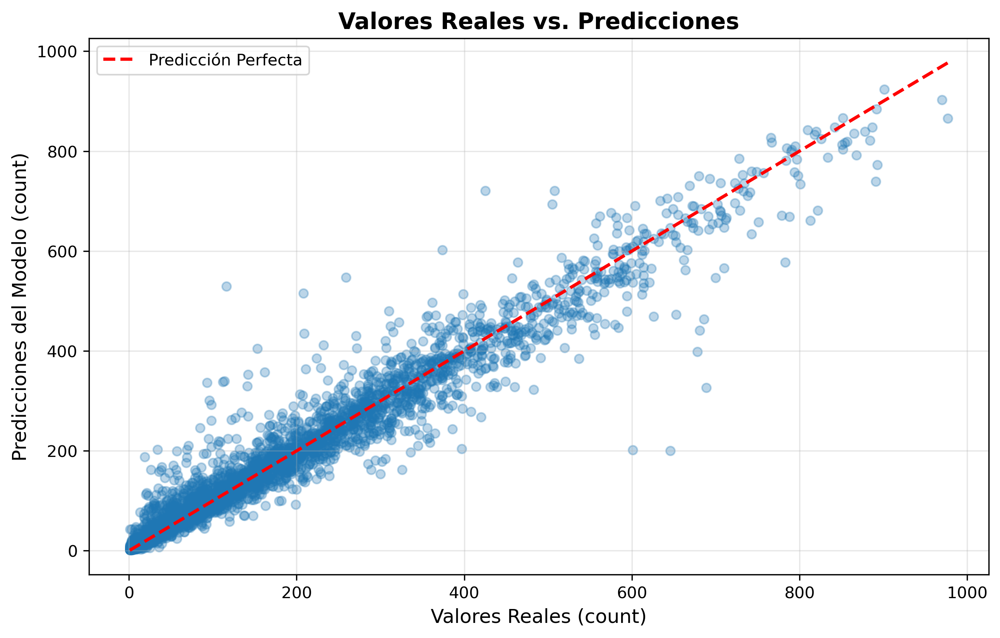
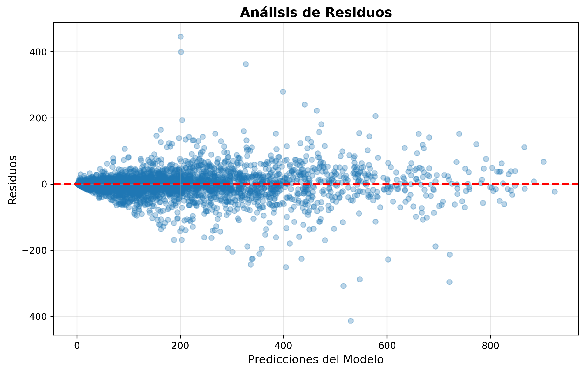
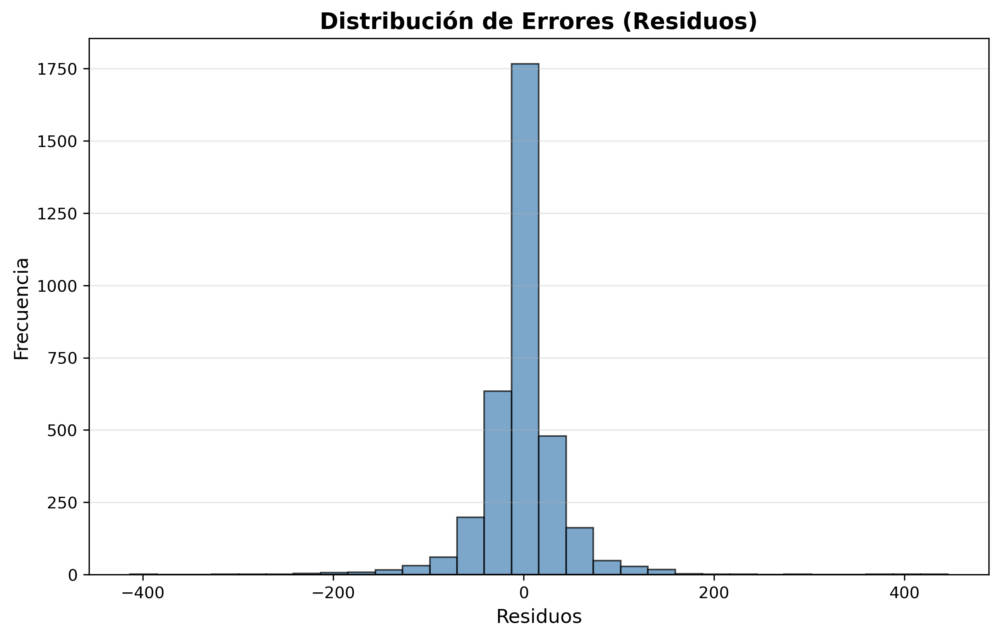
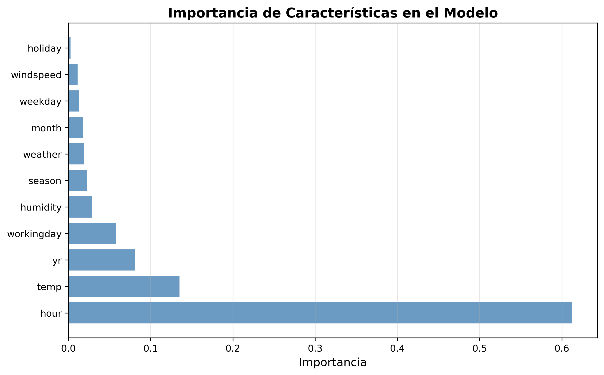
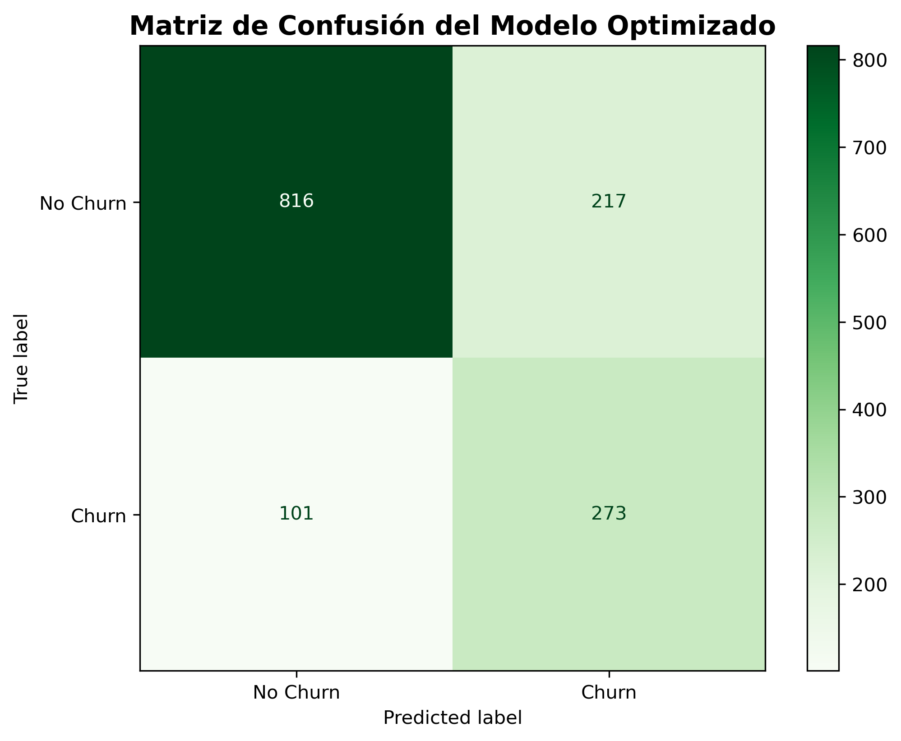
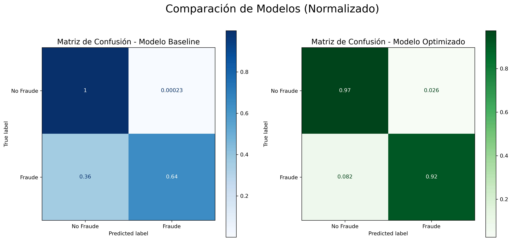

# Machine Learning I
## Taller: Regresión para la Demanda de Bicicletas y Manejo de Desbalance de Clases

**Estudiantes:**
* Diego Suarez (0000277124) - Ingeniería Informática
* John Jairo Rojas (0000282452) - Ingeniería Informática
* Giovanni Moreno (0000247483) - Ingeniería Informática

**Universidad de la Sabana**  
**Machine Learning**  

**Profesor:** Hugo Franco, Ph.D.  
**Fecha:** 19 de octubre de 2025  

---

### 1. Predicción de la Demanda Horaria de Bicicletas

#### 1.1. Breve descripción del problema

Los sistemas de bicicletas compartidas (bike-sharing) son una solución de movilidad urbana sostenible. Para optimizar la gestión del inventario y la satisfacción del usuario, es crucial predecir la demanda horaria. Esto permite una redistribución eficiente de las bicicletas. 

El objetivo es solucionar un problema de **regresión** para predecir el conteo horario total de bicicletas alquiladas (`cnt`), basándose en características ambientales y temporales.

#### 1.2. Método de solución

Se aborda como un modelo de **regresión supervisada** usando un algoritmo de conjunto (ensemble).

**Datos empleados:**  
Se utilizó el archivo `hour.csv` del "Bike Sharing Dataset" de Kaggle.

**Variables relevantes:**  
* **Objetivo (y):** `count` (Numérica).  
* **Predictoras (X):** `season`, `holiday`, `workingday`, `weather`, `temp`, `humidity`, `windspeed`, `hour`, `month`, `year`, `weekday`.

**Proceso de solución:**  
El proceso consistió en:
1. **Carga y Preprocesamiento:** Cargar `hour.csv`, eliminar columnas no relevantes/fuga de datos, extraer variables de fecha/hora.
2. **Definición de X e y:** Separar características y objetivo.
3. **División de Datos:** Dividir 80% entrenamiento (13903 Muestras) / 20% prueba (3476 Muestras) (`random_state=42`).
4. **Entrenamiento del Modelo:** Entrenar un `RandomForestRegressor` (`n_estimators=100`, `random_state=42`). 
5. **Evaluación:** Evaluar con R², MAE y RMSE; analizar residuos e importancia de características.

El pseudocódigo general es:

```pseudocode
Algoritmo 1. Solución al problema de regresión (pseudocódigo)
función EntrenarModeloDemandaBicicletas: modelo
Parámetros: ruta_archivo_csv (tipo: String)

  datos = CargarDatos(ruta_archivo_csv)
  datos_limpios = PreprocesarDatos(datos) // Eliminar/Transformar columnas
  X, y = SepararVariables(datos_limpios, target='count')
  X_train, X_test, y_train, y_test = DividirDatos(X, y, test_size=0.2)
  
  modelo_RF = Inicializar(RandomForestRegressor, ...)
  modelo_entrenado = modelo_RF.fit(X_train, y_train)
  
  predicciones = modelo_entrenado.predict(X_test)
  R2, MAE, RMSE = CalcularMétricas(y_test, predicciones)
  
  ReportarResultados(R2, MAE, RMSE)
  GenerarGráficoDispersión(y_test, predicciones)
  AnalizarResiduos(y_test, predicciones, modelo_entrenado.predict(X_train))
  MostrarImportanciaCaracteristicas(modelo_entrenado, X.columns)
  
retornar modelo_entrenado
```

La implementación detallada se encuentra en el archivo `bike.py` adjunto.

#### 1.3. Resultados

La ejecución del script `bike.py` genera las siguientes métricas y gráficos:

Salida por consola:

```text
--- Métricas de Evaluación del Modelo ---
R² (Coeficiente de Determinación): 0.94
Error Absoluto Medio (MAE): 24.81
Raíz del Error Cuadrático Medio (RMSE): 42.31
```

Gráficos generados (Figuras 1a-1d):

**Figura 1a.** Gráfica de dispersión de Valores Reales vs. Predicciones.

**Figura 1b.** Análisis de Residuos (Predicciones vs. Residuos).  

**Figura 1c.** Histograma de la Distribución de Errores (Residuos).  

**Figura 1d.** Importancia de las Características según el modelo Random Forest.  

*Fuente: elaboración propia.*

#### 1.4. Discusión

El modelo `RandomForestRegressor` demostró ser **muy efectivo**.   
El **R² de 0.94** indica que el modelo explica el 94% de la varianza.  
El **MAE (24.81)** y **RMSE (42.31)** son bajos, sugiriendo errores pequeños y aceptables. 
La **Figura 1a** confirma la alta precisión general.  
El **Análisis de Residuos (Figura 1b)** y la **Distribución de Errores (Figura 1c)** sugieren que los errores son aleatorios y no sistemáticos, cumpliendo supuestos básicos de regresión.  
La **Importancia de Características (Figura 1d)** muestra que `hour`, `temp` y `yr` son los predictores más influyentes.  
En conclusión, el modelo es preciso, cumple supuestos y proporciona una **herramienta fiable** para la estimación de demanda. 

---

### 2. Predicción de Deserción de Clientes

#### 2.1. Breve descripción del problema

Se aborda la predicción de **deserción de clientes** (churn) en telecomunicaciones. El desafío es el **desbalance de clases** (aprox. 73% vs 27%). El objetivo es un modelo robusto que maneje este desbalance.

#### 2.2. Método de solución

Se implementó un flujo completo:

1. **Carga y Preprocesamiento:** Cargar, limpiar, codificar. Crear `ColumnTransformer` (StandardScaler + OneHotEncoder).  
2. **División Estratificada:** 80% entrenamiento / 20% prueba.  
3. **Manejo del Desbalance (SMOTE):** Usar SMOTE en `Pipeline` solo en entrenamiento.  
4. **Selección de Modelos:** Comparar Regresión Logística, Random Forest, XGBoost usando ROC AUC.  
5. **Optimización (`RandomizedSearchCV`):** Optimizar XGBoost (parámetros de XGBoost y SMOTE) usando `roc_auc`.  
6. **Evaluación Final:** Evaluar el mejor modelo en test.  


#### 2.3. Resultados

La ejecución del script `SMOTE_CustomerChurn.py` genera los siguientes resultados:

```text
--- Resultados de la Selección de Modelos ---
Modelo: Logistic Regression  | ROC AUC: 0.8332
Modelo: Random Forest        | ROC AUC: 0.8147
Modelo: XGBoost              | ROC AUC: 0.8199
```

```text
Mejores Hiperparámetros encontrados:
{'classifier__learning_rate': 0.014976348678356847, 'classifier__max_depth': 5, 'classifier__n_estimators': 246, 'classifier__subsample': 0.7394663949166917, 'smote__k_neighbors': 9}
Mejor ROC AUC Score (en validación cruzada): 0.8450
```

```text
Reporte de Clasificación (Modelo Optimizado):
              precision    recall  f1-score   support

    No Churn       0.89      0.79      0.84      1033
       Churn       0.56      0.73      0.63       374

    accuracy                           0.77      1407
   macro avg       0.72      0.76      0.73      1407
weighted avg       0.80      0.77      0.78      1407
```

**Figura 2.** Matriz de Confusión del Modelo Optimizado (XGBoost).  

*Fuente: elaboración propia.*

#### 2.4. Discusión

El flujo permitió optimizar XGBoost, alcanzando un ROC AUC de **0.8450**, superando la Regresión Logística inicial.  
El modelo logra un **recall de 0.73** para la clase 'Churn', identificando correctamente el 73% de los clientes que desertaron.  
La precisión para 'Churn' (0.56) y la buena detección de 'No Churn' (recall 0.79) evidencian un balance adecuado.  
El uso de **SMOTE** fue esencial para representar correctamente la clase minoritaria.   
El modelo final es robusto y generalizable.

---

### 3. Detección de Fraude con Tarjetas de Crédito

#### 3.1. Breve descripción del problema

Se aborda la **detección de fraude** con tarjetas de crédito, un problema con **extremo desbalance** (aprox. 0.17% fraude).  
Detectar fraudes es vital , y el objetivo es **maximizar el recall**.

#### 3.2. Método de solución

1. **Carga y Preprocesamiento:** Cargar `creditcard.csv`. Escalar `Time` y `Amount`.  
2. **División Estratificada:** 80% entrenamiento / 20% prueba.  
3. **Modelo Baseline:** Regresión Logística sin SMOTE.  
4. **Optimización (SMOTE + `RandomizedSearchCV`):**
   * `Pipeline` (SMOTE + Regresión Logística).  
   * `RandomizedSearchCV` para hiperparámetros.  
   * Optimizar para **recall** (20 iteraciones, CV=5).  
5. **Evaluación Comparativa:** Comparar baseline vs. optimizado.  


#### 3.3. Resultados

```text
Reporte del Modelo Baseline:
              precision    recall  f1-score   support

    No Fraude       1.00      1.00      1.00     56864
       Fraude       0.83      0.64      0.72        98
```

```text
Mejores Hiperparámetros encontrados:
{'classifier__C': 9.016655057071823, 'classifier__solver': 'liblinear', 'smote__k_neighbors': 13}
Mejor Recall Score (en validación cruzada): 0.9187
```

```text
Reporte de Clasificación (Modelo Optimizado):
              precision    recall  f1-score   support

    No Fraude       1.00      0.97      0.99     56864
       Fraude       0.06      0.92      0.11        98
```

**Figura 3.** Comparación de matrices de confusión normalizadas (baseline vs. optimizado).  

*Fuente: Ejecución del script `SMOTE.py`.*

#### 3.4. Discusión

El **modelo baseline** (izquierda) detecta solo 64% de fraudes (recall 0.64).  
El **modelo optimizado** (derecha) mejora a **recall 0.92**, detectando casi todos los fraudes. 
Aumentan los falsos positivos (2.6%), pero el trade-off es aceptable.  
La combinación **SMOTE + RandomizedSearchCV** fue **altamente efectiva**.   

---

### Referencias
* Dal Pozzolo, A., Caelen, O., Le Borgne, Y. A., Waterschoot, S., & Bontempi, G. (2015). Learned lessons in credit card fraud detection from a practitioner perspective. *Expert systems with applications*, *41*(10), 4915-4928.   
* Fanaee-T, H., & Gama, J. (2013). *Event labeling combining ensemble detectors and background knowledge*. Pattern Recognition, 46(10), 2788-2806.  
* IBM. (s.f.). *Telco Customer Churn*. Recuperado de https://raw.githubusercontent.com/IBM/telco-customer-churn-on-icp4d/master/data/Telco-Customer-Churn.csv  
* Kaggle. (s.f.). *Bike Sharing Dataset*. Recuperado el 19 de octubre de 2025, de https://www.kaggle.com/datasets/archit9406/bike-sharing.  
